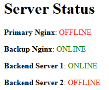

# High Availability Web Infrastructure with Load Balancing & Reverse Proxy


## Project Overview

This project aims to build a highly available (HA) web application setup that includes multiple backend servers, a reverse proxy, and secure communication using SSL. The architecture will ensure fault tolerance and scalability, providing a reliable and secure solution for hosting a web application. It includes deploying infrastructure, configuring a reverse proxy for load balancing, implementing SSL certificates for secure connections, and monitoring backend server health with a status page.

## Table of Contents  

1. [Project Overview](#project-overview)  
2. [Objectives](#objectives)  
3. [Infrastructure Overview](#infrastructure-overview)  
   - [Architecture Diagram](#architecture-diagram)  
4. [Setup Guide](#setup-guide)  
   - [Step 1: Deploy Backend Servers](#step-1-deploy-backend-servers)  
   - [Step 2: Deploy NGINX Load Balancer & Reverse Proxy](#step-2-deploy-nginx-load-balancer--reverse-proxy)  
   - [Step 3: Configure SSL](#step-3-configure-ssl)  
   - [Step 4: Set Up Status Page & Health Checks](#step-4-set-up-status-page--health-checks)  
   - [Step 5 (Bonus): Configure Backup Load Balancer with Keepalived for HA](#step-5-bonus-configure-backup-load-balancer-with-keepalived-for-ha)  


## Objectives

1. Domain & DNS Setup:
    * Set up a domain and create two subdomains:
        * `app.yourdomain.com` - A load balancer that directs traffic to the backend web application.
        * `status.yourdomain.com` – A status page to monitor the health of backend servers.
2. Infrastructure Setup:
    * Deploy two Virtual Machine (VM) instances running a simple web application (e.g., NGINX with different content on each backend).
    * Deploy a third VM to run NGINX as a reverse proxy and load balancer, directing traffic between the two backend servers.
3. SSL Configuration:
    * Use a tool like Let’s Encrypt to secure the `app.yourdomain.com` domain with an SSL certificate.
    * Enforce redirection from HTTP to HTTPS to ensure all connections are secure.
4.  Status Page & Health Checks:
    * Deploy a status page at `status.yourdomain.com` to display the health status of both backend servers.
    * The status page should show the current active backend server, using a simple script (e.g., `curl`) to check each server’s health.
5. Bonus Challenge (Optional):
    * Implement a highly available reverse proxy setup using a floating IP or deploy a second reverse proxy to ensure the setup remains functional in case of failure.

## Infrastructure Overview
### Architecture Diagram
```
                              ┌───────────────────────┐
                              │   Cloudflare DNS      │
                              │   app.madil.co.uk     │
                              │   status.madil.co.uk  │
                              └──────────┬────────────┘
                                         │
                                ┌────────▼────────┐
                                │  AWS Elastic IP │
                                │   13.50.113.87  │
                                └────────┬────────┘
                                         │
                    ┌────────────────────┴───────────────────┐
          ┌─────────▼────────┐                     ┌─────────▼────────┐
          │ Master LB (NGINX)│                     │ Backup LB (NGINX)│
          │ 172.31.47.11     │                     │ 172.31.39.64     │
          │ (Main traffic)   │                     │(Failover instance)
          └─────────┬────────┘                     └─────────┬────────┘
                    │                                        │
                    └──────┬──────────────────────────┬──────┘
                           │                          │
                          App                       Status 
                        Upstream                   Upstream
                           │                          │
                  ┌────────┴────────┐                 │
                  │                 │                 │
                  ▼                 ▼                 ▼
          Backend Server 1  Backend Server 2      Backend Server 1
          172.31.16.119     172.31.16.32          172.31.45.147
          (Web app)         (Web app)             (Health check)            
```
## Setup Guide
### Step 1: Deploy Backend Servers
* Launched two EC2 instances (Ubuntu 22.04)
* Allowed inbound traffic on ports `80`
* Installed and enabled NGINX to run on startup:
```bash
sudo apt update && sudo apt install -y nginx
```
```bash
sudo systemctl enable nginx
```
* Modified `/var/www/html/index.html` to display different content on each server
### Step 2: Deploy NGINX Load Balancer (& Reverse Proxy)
This load balancer will distribute traffic to the backend servers.
* Launched another EC2 instance, installed and enabled NGINX
* Allowed inbound traffic on ports `80`
* Configured DNS by creating an A record in Cloudflare, mapping `app.madil.co.uk` to the public IP of the load balancer


##### Modified the NGINX configuration file `/etc/nginx/nginx.conf`:
```bash
http {
    upstream backend_servers {
        server 172.31.16.119;
        server 172.31.16.32;
    }

    server {
        listen 80;
        server_name app.madil.co.uk;

        location / {
            proxy_pass http://backend_servers;
            proxy_set_header Host $host;
            proxy_set_header X-Real-IP $remote_addr;
        }
    }
}
```
```bash
sudo systemctl restart nginx
```

#### Verify Load Balancing:
* Accessed `app.madil.co.uk` and refreshed the page multiple times
* Observed different responses being served, indicating traffic was being distributed across the backend servers

* Confirmed that NGINX was correctly routing requests and balancing the load effectively

### Step 3: Configure SSL
The NGINX Load Balancer (LB) will handle all SSL/TLS encryption, offloading the decryption work from the backend servers. The LB will forward decrypted traffic to the backend servers via their private IPs, ensuring that the backend servers only handle unencrypted traffic. This setup reduces the load on the backend servers, allowing them to focus solely on processing application data.

To secure the web application with HTTPS, I used **Let’s Encrypt** to obtain an SSL certificate and configured NGINX to enforce HTTPS.

* Allowed inbound traffic on ports `443`
* Installed Cerbot and the NGINX plugin:
```bash
sudo apt install -y certbot python3-certbot-nginx
```
* Obtained SSL Certificate for `app.madil.co.uk` via Certbot:
```bash
sudo certbot --nginx -d app.madil.co.uk
```
* Certbot automatically configured SSL settings in the NGINX configuration.
* Followed the prompts to agree to the terms and allow automatic redirection from HTTP to HTTPS.

##### Updated NGINX configuration file `/etc/nginx/nginx.conf`:
```bash
server {
    listen 80;
    server_name app.madil.co.uk;
    return 301 https://$host$request_uri;
}

server {
    listen 443 ssl;
    server_name app.madil.co.uk;

    ssl_certificate /etc/letsencrypt/live/app.madil.co.uk/fullchain.pem;
    ssl_certificate_key /etc/letsencrypt/live/app.madil.co.uk/privkey.pem;
    include /etc/letsencrypt/options-ssl-nginx.conf;
    ssl_dhparam /etc/letsencrypt/ssl-dhparams.pem;

    location / {
        proxy_pass http://backend_servers;
        proxy_set_header Host $host;
        proxy_set_header X-Real-IP $remote_addr;
    }
}
```
#### Validating HTTPS Access:


### Step 4: Set Up Status Page & Health Checks
* Launched EC2 instance to serve as a simple status page for real time system health monitoring
* Configured an additional upstream server block in NGINX to route traffic to the status page
* Obtained SSL Certificate for `status.madil.co.uk` via Certbot
* Added an A record in Cloudflare, pointing `status.madil.co.uk` to the IP of the load balancer
* Developed a bash script to monitor server health and generate a simple HTML report:
```bash
OUTPUT_HTML="/var/www/html/index.nginx-debian.html"

echo "<html>" > $OUTPUT_HTML
echo "<head><title>Server Status</title></head>" >> $OUTPUT_HTML
echo "<body><h1>Server Status</h1>" >> $OUTPUT_HTML

check_status() {
    NAME=$1
    IP=$2
    STATUS=$(curl -k -L -s -o /dev/null -w "%{http_code}" "http://$IP")

    if [ "$STATUS" -eq 200 ]; then
       echo "<p><b>$NAME</b>: <span style='color:green;'>ONLINE</span></p>" >> $OUTPUT_HTML
    else
       echo "<p><b>$NAME</b>: <span style='color:red;'>OFFLINE</span></p>" >> $OUTPUT_HTML
    fi
}

check_status "Primary Nginx" "172.31.47.11"
check_status "Backup Nginx" "172.31.39.64"
check_status "Backend Server 1" "172.31.16.119"
check_status "Backend Server 2" "172.31.16.32"

echo "</body></html>" >> $OUTPUT_HTML
```
> The `curl` command checks each server's HTTP status by sending a request and retrieving the response code. It uses `-k` to ignore SSL warnings, `-L` to follow redirects, and `-s` for silent mode. The `-w "%{http_code}`" option outputs the status code, allowing the script to mark the server as ONLINE (HTTP 200) or OFFLINE (any other code).

* Automated the script to run every minute using `Cron`:
1. Make the script executable: `chmod +x /path/to/status_script.sh`
2. Open the crontab editor: `crontab -e`
3. Add the following line to run the script every minute: `* * * * * /path/to/status_script.sh`

#### Testing Status Page:
Once executed, the script dynamically generates a status page displaying real time server health.


##### Modified NGINX configuration file `/etc/nginx/nginx.conf`:
```bash
http {
        upstream backend_servers{
                server 172.31.16.119;
                server 172.31.16.32;
        }
        upstream status_servers{
                server  172.31.45.147;
        }
        server {
                listen 80;
                server_name app.madil.co.uk;
                return 301 https://$host$request_uri;
        }
        server {
                listen 80;
                server_name status.madil.co.uk;
                return 301 https://$host$request_uri;
        }
        server {
                listen 443 ssl;
                server_name app.madil.co.uk;

                ssl_certificate /etc/letsencrypt/live/app.madil.co.uk/fullchain.pem;
                ssl_certificate_key /etc/letsencrypt/live/app.madil.co.uk/privkey.pem;
                include /etc/letsencrypt/options-ssl-nginx.conf;
                ssl_dhparam /etc/letsencrypt/ssl-dhparams.pem;

                location / {
                        proxy_pass http://backend_servers;
                }
        }
        server {
                listen 443 ssl;
                server_name status.madil.co.uk;
                ssl_certificate /etc/letsencrypt/live/status.madil.co.uk/fullchain.pem;
                ssl_certificate_key /etc/letsencrypt/live/status.madil.co.uk/privkey.pem;
                include /etc/letsencrypt/options-ssl-nginx.conf;
                ssl_dhparam /etc/letsencrypt/ssl-dhparams.pem;

                location / {
                        proxy_pass http://status_servers;
                }
        }
}
```
>The load balancer will now route traffic to the appropriate backend server depending on the requested URL. Requests to `app.madil.co.uk` will be forwarded to the backend servers running the web application, while requests to `status.madil.co.uk` will be directed to the status page server

### Step 5 (bonus): Configure Backup Load Balancer with Keepalived for HA
To ensure high availability (HA) for the reverse proxy setup, I configured a **Backup Load Balancer** using **Keepalived**. This setup guarantees that if the Primary LB goes down, the Backup LB will automatically take over an Elastic IP (EIP), allowing uninterrupted access to the application.

Choosing **Keepalived** over services like AWS **Application Load Balancer (ALB)** can be beneficial for several reasons:

* **Cost Efficiency:** Keepalived is free and doesn't incur additional usage charges like ALBs.
* **Full Control:** It allows for granular control over failover behavior, unlike ALBs which have limited customization.
* **Cloud-Agnostic:** Keepalived works across different cloud providers and on-premise environments, making it ideal for hybrid or multi-cloud setups.

This configuration follows the ["Active-Passive HA for NGINX Plus on AWS Using Elastic IP Addresses"](https://docs.nginx.com/nginx/deployment-guides/amazon-web-services/high-availability-keepalived/) tutorial from the official NGINX documentation guides.

#### Setup:
* Created an image of the primary NGINX Load Balancer and launched a backup Load Balancer instance using the image.
* Allocated and associated an Elastic IP to the primary LB
* Created an IAM role with a custom policy to allow management of the EIP, including associating and disassociating the address:
```yaml
{
    "Version": "2012-10-17",
    "Statement": [
        {
            "Effect": "Allow",
            "Action": [
                "ec2:AssociateAddress",
                "ec2:DescribeInstances",
                "ec2:DescribeAddresses",
                "ec2:DisassociateAddress"
            ],
            "Resource": "*"
        }
    ]
}
```
* Installed Keepalived on both the Primary and Backup Load Balancer instances:
```bash
sudo apt install -y keepalived
```
The NGINX Plus HA solution uses two scripts, which are invoked by keepalived:
* **nginx-ha-check** – Determines the health of the LB instances
* **nginx-ha-notify** – Moves the Elastic IP address when a state transition happens, for example when the backup instance becomes the primary.

##### Created the Keepalived configuration file `/etc/keepalived/keepalived.conf`:
```bash
vrrp_script chk_nginx_service {
    script "<path-to-health-check-script>"
    interval 3
    weight 50
}
vrrp_instance VI_1 {
    interface eth0
    priority <priority>
    virtual_router_id 51
    advert_int 1
    unicast_src_ip <internal-ip-address-of-instance>
    unicast_peer {
        <internal-ip-address-of-other-instance>
    }
    authentication {
        auth_type PASS
        auth_pass <password>
    }
    track_script {
        chk_nginx_service
    }
    notify "<path-to-notify-script>"
}
```
> **NOTE:** *priority* is the value that controls which instance becomes primary, with a higher value meaning a higher priority. Used 101 for the primary instance and 100 for the backup.

##### Modified nginx-ha-check:
```bash
export AWS_ACCESS_KEY_ID=<value>
export AWS_SECRET_ACCESS_KEY=<value>
export AWS_DEFAULT_REGION=eu-north-1
HA_NODE_1=ip-172-31-47-11.eu-north-1.compute.internal
HA_NODE_2=ip-172-31-39-64.eu-north-1.compute.internal
ALLOCATION_ID=<value>
```
```bash
sudo systemctl start keepalived
```
#### Validating Failover:
* Checked the initial state of the instances by running the following command:
```bash
cat /var/run/nginx-ha-keepalived.state
```
This command outputs `STATE=MASTER` on the primary instance and `STATE=BACKUP` on the secondary instance.
* Simulated a failure of the primary by stopping the Keepalived service:
```bash
sudo service keepalived stop
```
* Verified the failover by checking the state on the backup instance, confirming that it had successfully transitioned to the `MASTER` state. Additionally, in the AWS Console, the Elastic IP address was automatically reassigned to the backup LB, ensuring continuous traffic flow.

## Final Thoughts & Improvements  

This project successfully demonstrates a **highly available** web infrastructure with load balancing, reverse proxying, and real time server health monitoring. By implementing NGINX as a **load balancer**, securing traffic with **SSL**, and automating server health checks, I have successfuly built a **fault tolerant and scalable** system that ensures continuous availability.  The setup is further enhanced by a **backup load balancer**, which automatically takes over in case of failure, seamlessly assuming control of the floating Elastic IP to maintain a consistent public facing address and ensure uninterrupted access.

### Potential Improvements:  
- **Automated Scaling**: Integrate AWS Auto Scaling Groups to dynamically adjust the number of backend servers based on traffic demand.  
- **Enhanced Security**: Implement Network ACLs (NACLs) for an additional layer of protection against unauthorized access.
- **Multi-Region Deployment**: Expand the infrastructure across multiple AWS regions to achieve geo-redundancy and improve disaster recovery.  

